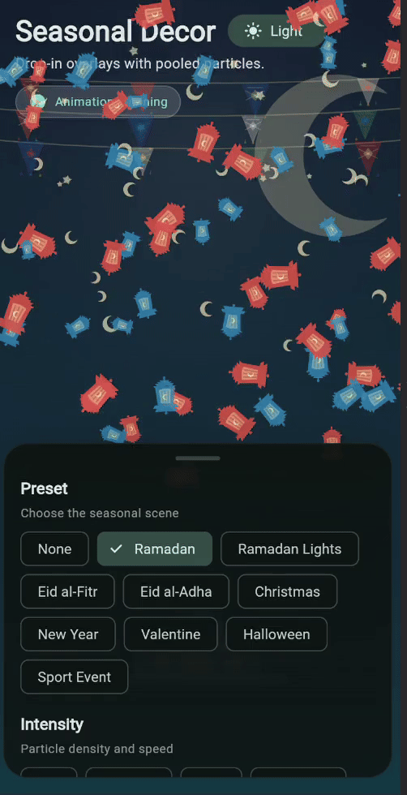
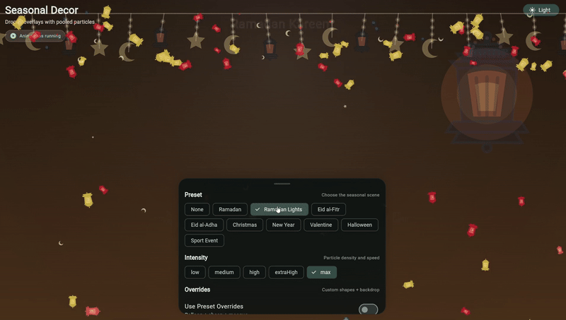
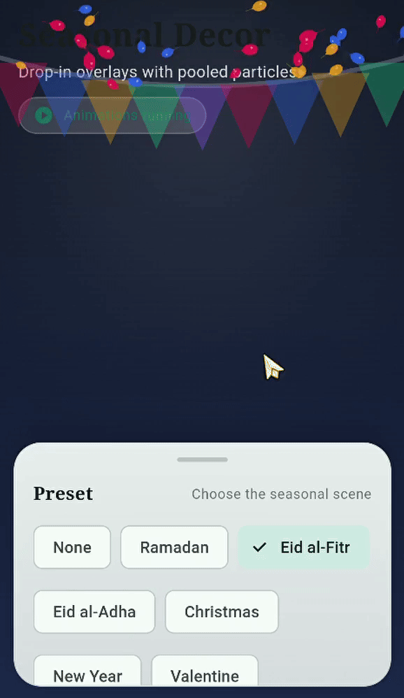
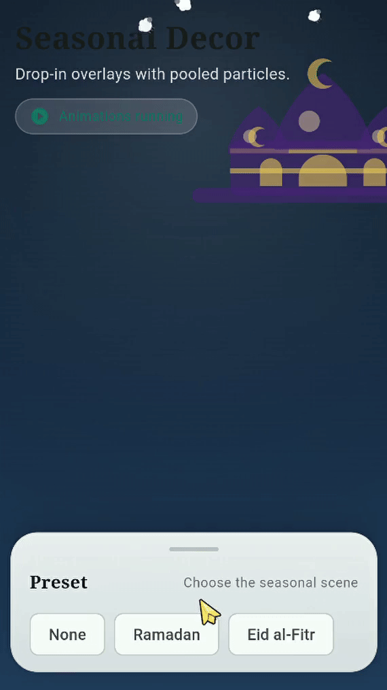
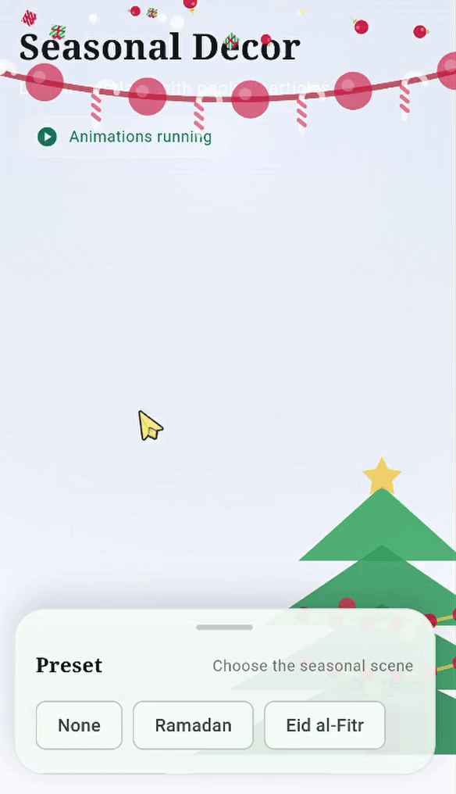
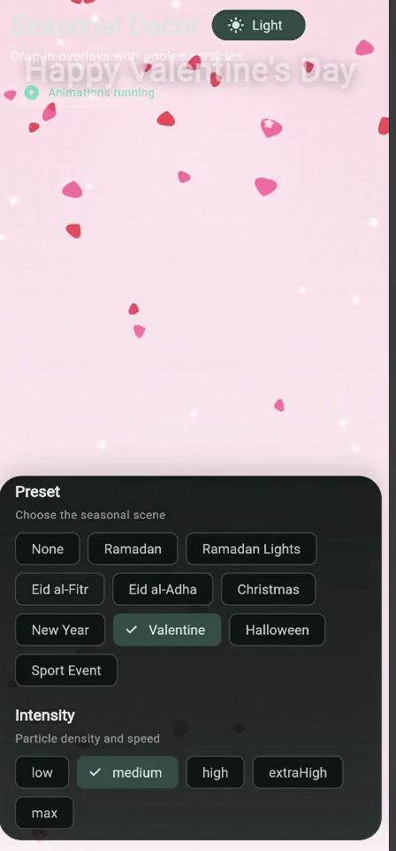
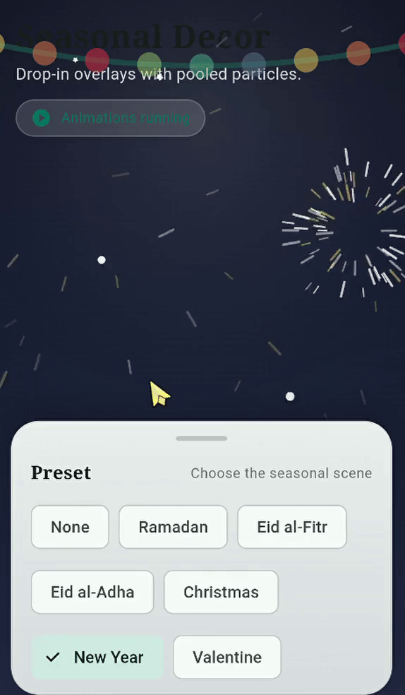
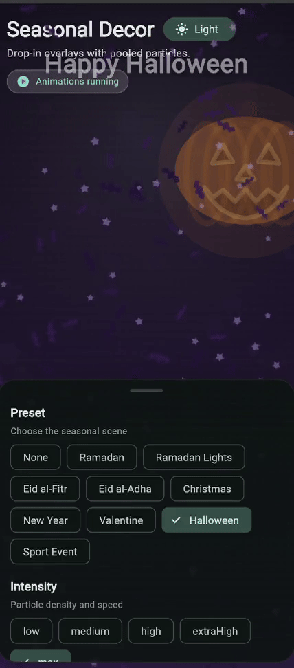
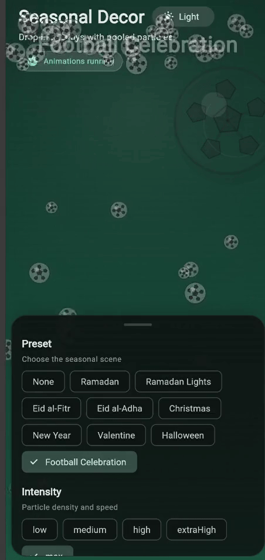

# seasonal_decor


[](https://flutter.dev)
[](https://pub.dev/packages/seasonal_decor)


Add beautiful seasonal animations and festive overlays to your Flutter app with one line of code.

Bring Ramadan vibes, Christmas magic, Valentine effects, New Year celebrations, and more instantly.

**Install with one command: `flutter pub add seasonal_decor`**

## ✨ Features

- 🎄 Christmas snow and festive decorations
- 🌙 Ramadan lanterns and crescents
- 🎉 Eid balloons and sparkles
- 🎃 Halloween particles and spooky mood
- ❤️ Valentine hearts
- 🎆 New Year fireworks and confetti
- ⚽ Football celebration mode
- 🌗 Light and dark theme adaptation
- 📱 Android, iOS, Web, Windows, macOS, Linux
- 🎛 Control intensity, speed, size, and backdrop layers
- 💬 Animated greeting text (`showText`, `text`, `textOpacity`)

## 🚀 Quick Start

```dart
SeasonalDecor(
  preset: SeasonalPreset.ramadan(),
  intensity: DecorIntensity.medium,
  child: const HomeScreen(),
);
```

That is it. Instant festive UI.

## ✅ Recommended Setup

```dart
SeasonalDecor(
  preset: SeasonalPreset.ramadan(),
  intensity: DecorIntensity.high,
  playDuration: const Duration(seconds: 8),
  repeatEvery: const Duration(minutes: 2),
  showBackdrop: true,
  showText: true,
  textOpacity: 0.5,
  particleSpeedMultiplier: 1.1,
  adaptColorsToTheme: true,
  child: const HomeScreen(),
);
```

Recommended defaults for most apps:

- Keep `respectReduceMotion: true` (default)
- Keep `pauseWhenInactive: true` (default)
- Use `intensity: DecorIntensity.medium/high` for daily screens
- Use `high/extraHigh/max` only for short celebration moments

## 🎮 Interactive Demo Controls

In the advanced example app (`example/lib/advanced_main.dart`), users can interact with:

- Preset picker and intensity controls
- `repeatEvery` and play duration
- Backdrop visibility by layer (background/decorative)
- Greeting text toggle, text input, and text animation controls
- Reduce-motion behavior and simulation

## 🎨 Available Presets

- `SeasonalPreset.ramadan()`
- `SeasonalPreset.ramadan(variant: RamadanVariant.hangingLanterns)` (new)
- `SeasonalPreset.eid()`
- `SeasonalPreset.christmas()`
- `SeasonalPreset.newYear()`
- `SeasonalPreset.valentine()`
- `SeasonalPreset.halloween()`
- `SeasonalPreset.football()`
- `SeasonalPreset.none()`

## 🎬 Preset GIF Previews

If GIFs do not render in your mirror/CDN, open files directly from `assets/gif/`.

| Ramadan | Ramadan Lights | Eid al-Fitr |
| --- | --- | --- |
|  |  |  |

| Eid al-Adha | Christmas | Valentine |
| --- | --- | --- |
|  |  |  |

| New Year | Halloween | Football |
| --- | --- | --- |
|  |  |  |

## 🎛 Customization

```dart
SeasonalDecor(
  preset: SeasonalPreset.christmas(),
  intensity: DecorIntensity.high,
  particleSpeedMultiplier: 1.2,
  particleSizeMultiplier: 1.1,
  showBackdrop: true,
  showBackgroundBackdrops: true,
  showDecorativeBackdrops: true,
  showText: true,
  textOpacity: 0.5,
  repeatEvery: const Duration(minutes: 2),
  child: const HomeScreen(),
);
```

## ⚔️ Why Not Just Confetti ?

| Feature                      | `seasonal_decor` | `confetti`-style package |
| ---------------------------- | ---------------- | ------------------------ |
| Seasonal presets             | Yes              | No                       |
| Decorative backdrops         | Yes              | No                       |
| One-line setup               | Yes              | Limited                  |
| Theme adaptive               | Yes              | No                       |
| Greeting text overlay        | Yes              | No                       |
| Layer-level backdrop control | Yes              | No                       |

## 🌍 Live Demo

[Live Demo](https://tamourax.github.io/seasonal_decor/)

## 📦 Installation

Add this to your `pubspec.yaml`:

```yaml
dependencies:
  seasonal_decor: ^1.3.2
```

Then run:

```bash
flutter pub get
```

Or simply:

```bash
flutter pub add seasonal_decor
```

## 🧪 Quick Recipes

Confetti only (disable fireworks in New Year):

```dart
SeasonalDecor(
  preset: SeasonalPreset.newYear(),
  presetEnableFireworks: false,
  child: const HomeScreen(),
);
```

Backdrop only:

```dart
SeasonalDecor(
  preset: SeasonalPreset.ramadan(),
  showBackdrop: true,
  presetShapes: const <ParticleShape>[], // disable particle styles
  // Optional (best performance): keep backdrop static without animation ticks.
  // enabled: false,
  // showBackdropWhenDisabled: true,
  child: const HomeScreen(),
);
```

Greeting text with default seasonal message:

```dart
SeasonalDecor(
  preset: SeasonalPreset.ramadan(),
  showText: true,
  textOpacity: 0.5, // default
  child: const HomeScreen(),
);
```

Custom message:

```dart
SeasonalDecor(
  preset: SeasonalPreset.eid(variant: EidVariant.adha),
  showText: true,
  text: 'Eid Mubarak',
  textStyle: const TextStyle(
    fontSize: 36,
    fontWeight: FontWeight.w700,
  ),
  textDisplayDuration: const Duration(seconds: 2),
  textAnimationDuration: const Duration(milliseconds: 550),
  child: const HomeScreen(),
);
```

Custom background backdrop widget:

```dart
SeasonalDecor(
  preset: SeasonalPreset.ramadan(),
  showBackdrop: true,
  backgroundBackdrop: Align(
    alignment: const Alignment(0.85, -0.7),
    child: Icon(Icons.nightlight_round, size: 180, color: Color(0x66FFE2A6)),
  ),
  child: const HomeScreen(),
);
```

## ⚙️ Core Options (Full Table)

| Option | Type | Default | Description |
| --- | --- | --- | --- |
| `key` | `Key?` | `null` | Optional widget key. |
| `child` | `Widget` | Required | Widget rendered under the seasonal overlay. |
| `preset` | `SeasonalPreset` | Required | Preset scene (`ramadan`, `eid`, `christmas`, `football`, etc.). |
| `enabled` | `bool` | `true` | Enables/disables particles and timed playback. |
| `intensity` | `DecorIntensity` | `DecorIntensity.medium` | Controls particle count and base speed profile. |
| `opacity` | `double` | `1.0` | Global overlay opacity multiplier. |
| `respectReduceMotion` | `bool` | `true` | Honors platform "reduce motion" accessibility setting. |
| `pauseWhenInactive` | `bool` | `true` | Pauses animation while app is backgrounded/inactive. |
| `ignorePointer` | `bool` | `true` | Lets touches pass through the overlay. |
| `playDuration` | `Duration` | `Duration(seconds: 5)` | Time to keep each play cycle running. |
| `settleOnDisable` | `bool` | `true` | Lets particles settle smoothly when stopped. |
| `repeatEvery` | `Duration?` | `null` | Optional interval to replay after each cycle. |
| `showBackdrop` | `bool` | `true` | Master toggle for all backdrop rendering. |
| `showBackdropWhenDisabled` | `bool` | `true` | Keeps backdrops visible even when `enabled: false`. |
| `showBackgroundBackdrops` | `bool` | `true` | Toggle for background-layer built-in backdrops. |
| `backgroundBackdrop` | `Widget?` | `null` | Custom widget replacing built-in background backdrops. |
| `showDecorativeBackdrops` | `bool` | `true` | Toggle for decorative-layer built-in backdrops. |
| `showText` | `bool` | `false` | Shows animated seasonal greeting text. |
| `text` | `String?` | `null` | Custom greeting; when empty/null uses preset default text. |
| `textStyle` | `TextStyle?` | `null` | Overrides greeting text style. |
| `textOpacity` | `double` | `0.5` | Greeting text opacity multiplier. |
| `textAlignment` | `Alignment` | `Alignment.topCenter` | Greeting text alignment in overlay. |
| `textPadding` | `EdgeInsets` | `EdgeInsets.fromLTRB(20, 56, 20, 0)` | Padding around greeting text. |
| `textDisplayDuration` | `Duration` | `Duration(milliseconds: 1800)` | How long text stays visible before exit animation. |
| `textAnimationDuration` | `Duration` | `Duration(milliseconds: 550)` | Enter/exit animation duration for text. |
| `textSlideOffset` | `Offset` | `Offset(0, -0.2)` | Slide offset used for hidden text position. |
| `particleSpeedMultiplier` | `double` | `1.0` | Additional runtime multiplier for particle speed. |
| `particleSizeMultiplier` | `double` | `1.0` | Additional runtime multiplier for particle size. |
| `decorativeBackdropDensityMultiplier` | `double` | `1.0` | Density multiplier for decorative backdrop details. |
| `decorativeBackdropRows` | `int?` | `null` | Fixed row count for decorative rows (garlands/bunting/lights). |
| `ramadanBuntingRows` | `int?` | `null` | Fixed row count specifically for Ramadan bunting. |
| `adaptColorsToTheme` | `bool` | `true` | Adapts colors for light/dark theme visibility. |
| `presetShapes` | `List<ParticleShape>?` | `null` | Overrides preset particle shapes. |
| `presetStyles` | `List<ParticleStyle>?` | `null` | Overrides full preset particle styles. |
| `presetShapeSpeedMultipliers` | `Map<ParticleShape, double>?` | `null` | Per-shape speed multipliers applied to preset styles. |
| `presetBackdrop` | `DecorBackdrop?` | `null` | Overrides preset single backdrop. |
| `presetBackdrops` | `List<DecorBackdrop>?` | `null` | Overrides preset backdrop list. |
| `presetBackdropType` | `BackdropType?` | `null` | Overrides type for preset backdrop(s). |
| `presetBackdropAnchor` | `Offset?` | `null` | Overrides anchor for preset backdrop(s). |
| `presetBackdropSizeFactor` | `double?` | `null` | Overrides size factor for preset backdrop(s). |
| `presetBackdropColor` | `Color?` | `null` | Overrides color for preset backdrop(s). |
| `presetBackdropOpacity` | `double?` | `null` | Overrides opacity for preset backdrop(s). |
| `presetEnableFireworks` | `bool?` | `null` | Overrides fireworks behavior for presets that support it. |

## 🧪 Example

Run example app:

```bash
flutter run -t example/lib/main.dart
```

Run advanced demo:

```bash
flutter run -t example/lib/advanced_main.dart
```

## 📄 License

MIT License. See [LICENSE](LICENSE).
